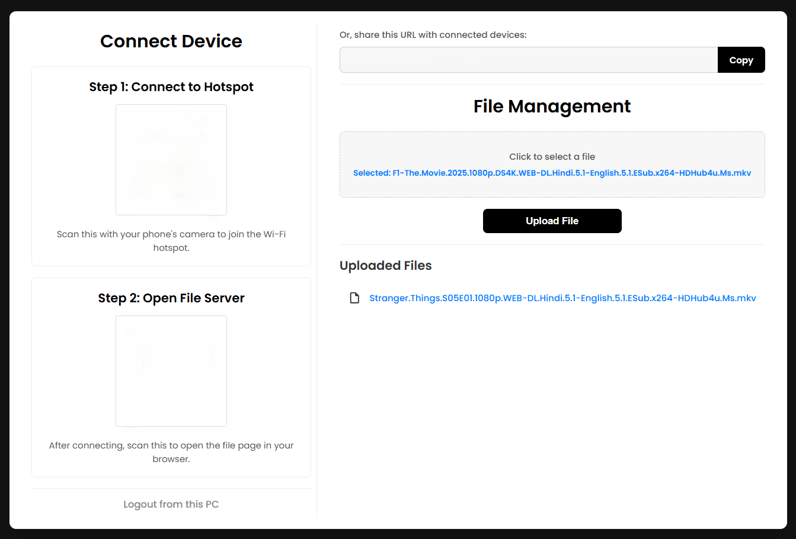
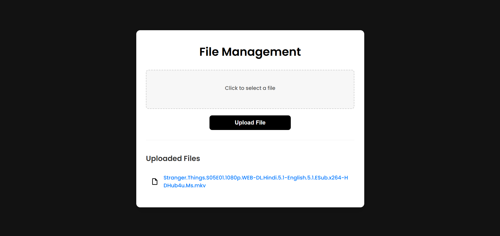
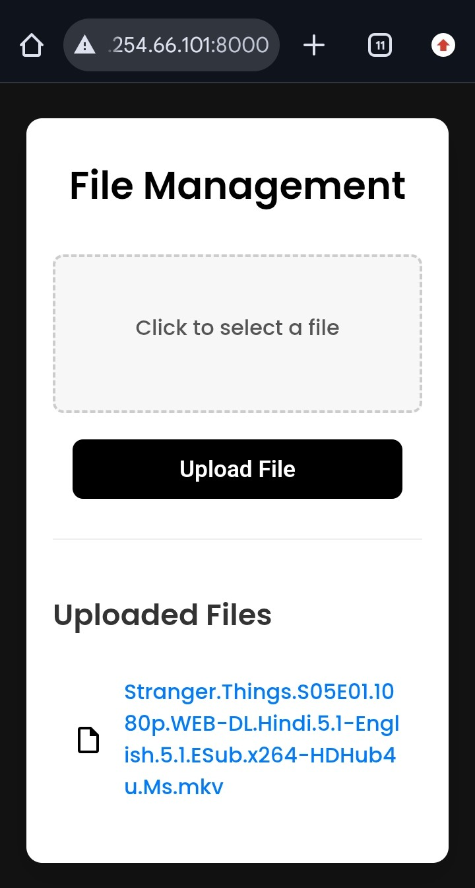

# 📁 File Transfer Server

A **secure, local file-sharing server** that runs over your PC’s Wi-Fi hotspot.  
Share files between your **PC and mobile devices** — No internet is required while transferring files! ⚡  

---

## ✨ Features

- 🔐 **Secure Login** – Password-protected admin dashboard  
- 📱 **Mobile-Friendly** – Responsive interface for phones  
- 🔄 **Two-Way Transfer** – Upload and download files between any device  
- 📊 **QR Code Connect** – Scan to join Wi-Fi and access instantly  
- 🎨 **Modern Dark UI** – Clean, simple design  
- 🚀 **Offline Support** – Works fully offline via your hotspot  

---

## 📋 Prerequisites

- 🐍 **Python 3.7 or higher**  
- 💻 PC with **Mobile Hotspot** capability  
- 📱 Any smartphone with a **QR code scanner**

---

## 🔒 Security

- ✅ Login protected dashboard
- ✅ Credentials stored securely in .env
- ✅ Only works on your local hotspot network
- ⚠️ Do not expose to the internet
- ⚠️ Change default passwords before use

---

## 🖼️ Screenshots

Replace these placeholder images with real screenshots from your project.  
Recommended folder: `/screenshots/`

### Login Page


### Server


### PC Upload


### Mobile Upload


### PC Download


### Mobile Download


---

## 🚀 Installation

- ### Clone the Repository
```bash
git clone https://github.com/Patel-Priyank-1602/file-transfer.git
cd hotspot-file-server
```

- ### Install Dependencies
```bash
pip install flask python-dotenv qrcode pillow
```

- ### Configure Environment Variables
```bash
# --- Hotspot Details ---
HOTSPOT_SSID=YourHotspotName
HOTSPOT_PASSWORD=YourHotspotPassword
HOTSPOT_IP=YourHotspotIp
PORT=8000

# --- Admin Credentials ---
ADMIN_USERNAME=admin
ADMIN_PASSWORD=your_secure_password

# --- App Settings ---
SECRET_KEY=your_secret_key_change_this
UPLOAD_FOLDER=shared_files
```

- ### Find Your Hotspot IP
#### Windows, macOS
```bash
ipconfig
```
#### Linux
```bash
ip addr show
```

---

## 🗂️ Project Structure
```bash
file-transfer/
├── app.py              # Flask main app
├── .env                # Configuration file
├── .gitignore          # Ignored files
├── README.md           # Documentation
└── shared_files/       # Uploaded files
```
